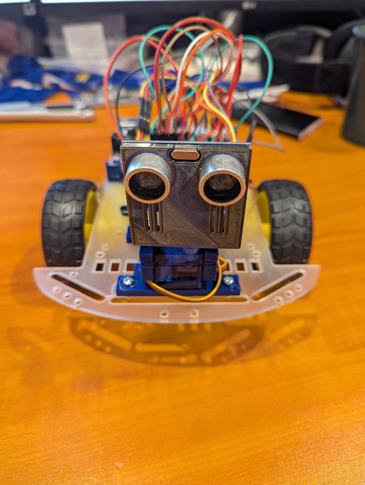

# 2025-CT-Y10-Assessment1

Develop and demonstrate an autonomous robot capable of navigating an unknown maze from start to end
You will need to complete and submit:
- problem analysis and plan
- robot and software design 
- software implementation and robot prototype
- testing of software and robot operations
- diary of activities
- in class demonstration of working robot

## Documentation
- Report scaffold documentation can be found in [docs](./docs/report.md)
- Your robot design does not need to match the one used for the demonstration. 
- You may use the provided robot as a guide to how your robot would be designed. 

## Code
- Your code will need to work on the provided robot
- Initial code has been provided in the `src` directory to get you started

## Demonstration
You will be provided with a robot that you can use to demonstrate a working solution.
- 3 mazes will be created for you robot to navigate
    - simple maze
    - maze with dead ends
    - maze with branching and dead ends

